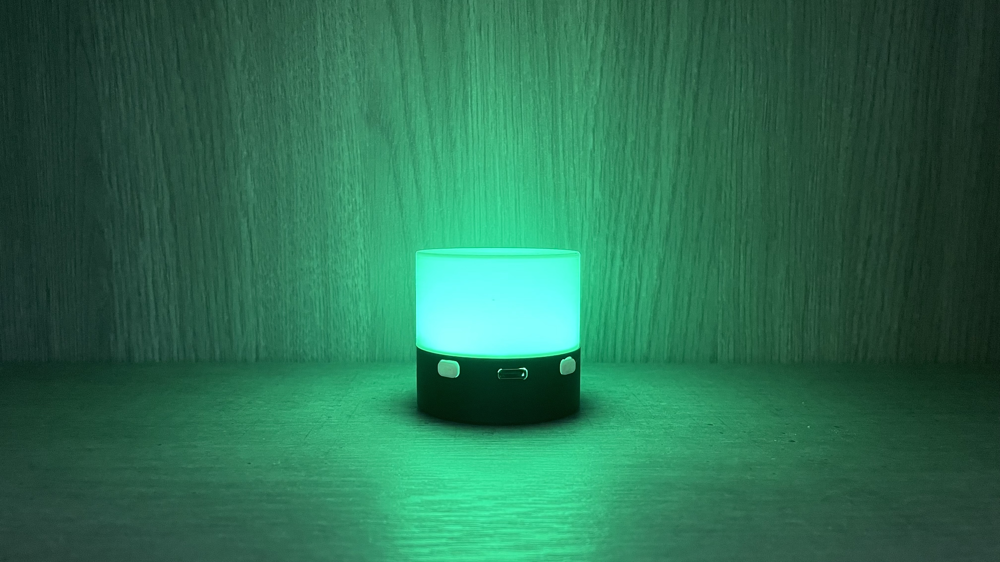
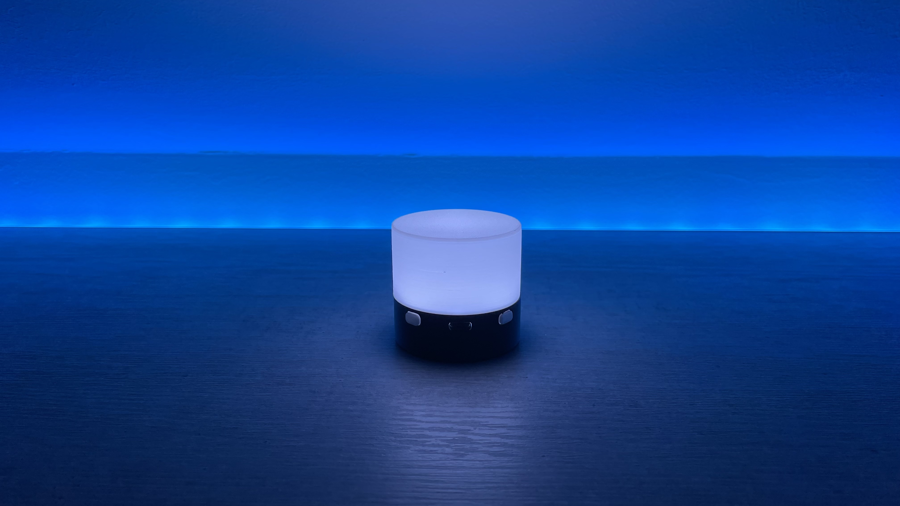
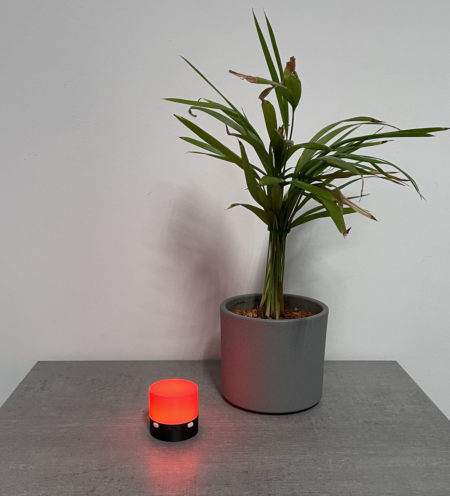

  

<h1 align="center" id="title">FrostlightMini</h1>

  A very small battery powered open source LED lamp.

  
  
  
  
  
  
  

> ⚠️ This lamp is still work in progress and not a final product.

## ✨ Overview

FrostlightMini is a hand sized RGB LED lamp based on a custom PCB with an ESP32-C3 chip.
It can be used as a night light, party light, or small IoT device.

  

The project is fully open source and includes firmware, hardware design files, and documentation.

## 🔧 Hardware Features

<table>
<tr>
    <td width="60%" valign="top">

* Custom PCB  
* ESP32-C3 microcontroller with WiFi, ZigBee and Bluetooth  
* RGB LED  
* Battery powered  
* USB-C for charging and programming  
* Two physical buttons for control  

    </td>
    <td width="40%" align="center">
        
    </td>
</tr>
</table>

## 💡 Modes

FrostlightMini currently supports two operating modes:

* **Color Mode**
  Used to select and cycle through colors

* **Brightness Mode**
  Used to increase or decrease LED brightness

The lamp boots into **Color Mode** by default.

  

## 🎮 Controls

FrostlightMini is controlled using the **two buttons**.
Button behavior depends on the currently active mode.

### Button Overview

| Button   | Purpose                     |
| -------- | --------------------------- |
| Button 1 | Mode switching and power    |
| Button 2 | Color or brightness control |

### Button 1, Mode & Power

  

| Action         | Effect                                                |
| -------------- | ----------------------------------------------------- |
| Short press    | Switch between **Color Mode** and **Brightness Mode** |
| Hold ~1 second | Turn the lamp off                                     |

Additional behavior:

* Entering **Color Mode** plays a color wheel animation
* Entering **Brightness Mode** is indicated by a short flash
* When powering off, the lamp flashes once, release the button to confirm shutdown

### Button 2, Mode Action Button

  

#### In Color Mode

| Action      | Effect                            |
| ----------- | --------------------------------- |
| Short press | Switch directly to white          |
| Hold        | Cycle continuously through colors |

If the current color is white, holding the button starts cycling from red.

#### In Brightness Mode

| Action      | Effect                                                   |
| ----------- | -------------------------------------------------------- |
| Short press | Toggle between brightness increase and decrease          |
| Hold        | Continuously adjust brightness in the selected direction |

Additional behavior:

* A short flash indicates switching between increase/decrease
* Brightness Mode always starts in **decrease** mode

### 🔋 Charging Behavior

When the lamp is connected to power via USB-C, it enters a charging indicator mode.

| State         | Indicator           | How to exit                            |
| ------------- | ------------------- | -------------------------------------- |
| Charging      | Green pulsing light | Unplug USB-C or short-press any button |
| Fully charged | Blue pulsing light  | Short-press any button                 |

**Notes:**

* The charging indicator is shown automatically when the lamp is plugged in
* Pressing any button will return the lamp to normal operation while still plugged in

## 🔌 Power & Charging

* The lamp is powered by an internal lipo battery
* Charging is done via the USB-C port
* USB-C is also used for firmware flashing and development

## 🧑‍💻 Development

This project uses **PlatformIO** for firmware development.

Typical workflow:

* Open the project in PlatformIO
* Connect the lamp via USB-C
* Build and upload the firmware

## 📁 Repository Structure

* `firmware/` – ESP32-C3 firmware
* `hardware/` – PCB and hardware design files
* `images/` – Images used in this README
* `documentation/` – Additional documentation (if available)

## 🚧 Project Status

FrostlightMini is under active development.

Expect:

* Breaking changes
* Incomplete features
* Hardware and firmware revisions

Feedback, testing, and contributions are welcome.

## 🗺️ Roadmap

- [x] 0.1.0 | Basic functionality
- [x] 0.2.0 | Storing led state
- [ ] 0.3.0 | Serial communication
- [ ] 0.4.0 | Serial configuration
- [ ] 0.5.0 | Rewrite/Refactoring for better performance
- [ ] 0.6.0 | Permanent effects
- [ ] 0.7.0 | Desktop app
- [ ] 0.8.0 | Wireless communication
- [ ] 0.9.0 | Device synchronization
- [ ] 1.0.0 | Device hosted web app

## 🤝 Contributing

Contributions are appreciated.

You can help by:

* Reporting bugs
* Suggesting features
* Improving documentation
* Submitting pull requests

Please open an issue before making major changes.

## 📜 License

This project is licensed under the license specified in the repository.
See the `LICENSE` file for details.
